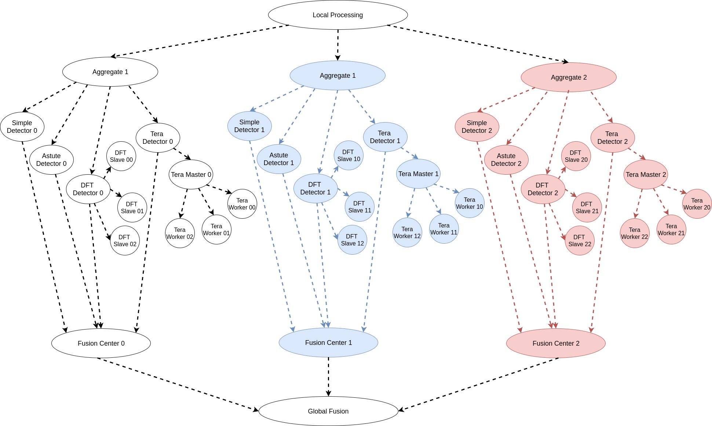

# Network_Anomaly_Detection_CIRCE
Coded Network Anomaly Detection application customized for Jupiter Orchestrator (available here: https://github.com/ANRGUSC/Jupiter).


# Network Anomaly Detection: Task Graph
The application task graph, shown below, is intended for dispersed computing. It is inspired from Hashdoop [1, 2], where a MapReduce framework is used for anomaly detection. We have modified the codes from [2] to suit our purpose.

 

## Generating the input files
Convert the pcap file to a text file using [Ipsumdump](http://www.read.seas.harvard.edu/~kohler/ipsumdump/) as follows:

```
ipsumdump -tsSdDlpF -r botnet-capture-20110810-neris.pcap > botnet_summary.ipsum
```
Single input file, 1botnet.ipsum, is given in a repository.


## Code Structure
Jupiter accepts pipelined computations described in a form of a Graph where the main task flow is represented as a Directed Acyclic Graph(DAG). 
Thus, one should be able separate the graph into two pieces, **the DAG part and non-DAG part**.
Jupiter requires that each task in the DAG part of the graph to be written as a Python function in a separate file under the `scripts` folder. 
On the other hand the non-DAG tasks can be either Python function or a shell script with any number of arguments, located under the `scripts` folder.
The folder structure is:
```
├── configuration.txt
├── DAG_directed.jpg
├── DAG.jpg
├── input_node.txt
├── LICENSE.txt
├── README.md
├── sample_input
│   ├── 1botnet.ipsum
│   └── 2botnet.ipsum
└── scripts
    ├── aggregate0.py
    ├── aggregate1.py
    ├── aggregate2.py
    ├── astutedetector0.py
    ├── astutedetector1.py
    ├── astutedetector2.py
    ├── config.json
    ├── dftdetector0.py
    ├── dftdetector1.py
    ├── dftdetector2.py
    ├── dftslave.py
    ├── fusioncenter0.py
    ├── fusioncenter1.py
    ├── fusioncenter2.py
    ├── globalfusion.py
    ├── localpro.py
    ├── masterServerStatic.py
    ├── parseFile.py
    ├── simpledetector0.py
    ├── simpledetector1.py
    ├── simpledetector2.py
    ├── teradetector0.py
    ├── teradetector1.py
    ├── teradetector2.py
    └── terasort
        ├── master
        │   ├── standby.sh
        │   ├── ...
        |
        └── worker
            └── rate-limit-then-standby.sh
```

## `sample_input` 
This folder is required according to the Jupiter guidelines as well as for testing.
One can leave it as an empty directory.

## `config.json`
According to Jupiter guideline, there MUST be a config.json file with an
entry called `taskname_map` to designate the DAG part and non DAG part of the task graph.
In this, each entry is represented as follows:
 ```
 <task_name> <task_file> <DAG_flag>  <Arguments>
 ``` 


`<task_name>` is the name of the dag task such as `simpledetector0`.

`<task_file>` is the name of the file to be run internally

`<DAG_flag`> represents whether the task is part of the DAG. If yes, set it to be `True` otherwise set it to be `False`.

`<Arguments>` represents the arguments for the tasks that are not part of the DAG portion of the task-graph.


For example, as `aggreagate0` is part of the DAG, the entry should be as follows.
```
"aggregate0"       : ["aggregate0", true]
```
On the other hand, `dftslave00` is not part of the DAG portion, then the entry should be as follows:
```
"dftslave00"       : ["dftslave", false, 0, 0, 3]
```
Here the arguments `0,0,3` are required by the dftslave script and represents the masterid, slaveid, and max number of slaves, respectively.

## `configuration.txt`
To conform with Jupiter guidelines, there MUST be a `configuration.txt` file representing the graph. 
Each line of the file represents the children of each node. 
To prepare the configuration file, first the task graph needs to be converted
to an arbitrary directed graph. 
It can be done by running a Breadth First Search (BFS) type algorithm. 
Then you get a graph something like: 

 


Now each of the non-leaf nodes and the leaf nodes that are part of original DAG
part are represented in the configuration files as 
 ```
 <node-name>  <number for inputs required> <Flag stating whether to wait for all the inputs> <child1-name>  <child2-name> ....
 ```

For all the other nodes (i.e,  leaf nodes that are not part of the original DAG portion) such as `DFTslave00` represent them as 
 ```
 <node-name>    1       False   <node-name> 
 ```
 
## `input_node.txt`
This file is required by the WAVE scheduler. This basically initiates the WAVE
scheduler's random mapping. 
This file includes random mapping for the tasks that has no parent.
For example, the given `input_node.txt` file randomly selects node4 for the `localpro` task.

## `script`
This folder contains all the executables related to the task graph.

### `local_pro.py`
 Process the Ipsum file locally and split the traffic into multiple independent streams based on the hash value of the IP adresses.
### `aggregate<SPLIT_ID>.py`
SPLIT_ID (0, 1 or 2, in our case) uniquely idenfifies the split. This script aggregates traffic for a particular traffic split from different monitoring nodes.
### `simple_detector<SPLIT_ID>.py`
A simple threshold based anomaly detector for the particular split.

### `astute_detector<SPLIT_ID>.py`
An implementation of ASTUTE anomaly detector [3] from the repository [2].

### `dftdetector<SPLIT_ID>.py`
An implementation of DFT detector (master) that communicates with DFT slave nodes to perform coded/uncoded
Discrete Fourier transform analysis of the data.

### `dftslave.py`
A common implementation of the DFT slave detectors that is called for all the DFTslave## tasks.

### `terasort/master`
This folder contains all the script required to run Terasort master 
that coordinates the coded/uncoded terasort analysis of the data among the Terasort workers.
 
### `terasort/worker`
This folder contains all the script required to run Terasort worker tasks.
 
### `teradetector<SPLIT_ID>.py`
As the terasort master and worker task nodes are not directly part of the DAG,
we have added this extra task to connect them to the DAG portion of the graph.
This script dispatches the input data to the teramaster<SPLIT_ID> for processing
and collects the output of the analysis and pass it to the Fusion Center.
 
### `fusion_center<SPLIT_ID>.py`
Combine the detected anomalies by different detectors for the particular split.

### `global_fusion.py`
Collect all the anomalies from different splits and combine the detected anomalies.

## Execution

This code is customized to be executed with Jupiter Only. 


# References
[1] Romain Fontugne, Johan Mazel, and Kensuke Fukuda. "Hashdoop: A mapreduce framework for network anomaly detection." Computer Communications Workshops (INFOCOM WORKSHOPS), IEEE Conference on. IEEE, 2014.

[2] [Hashdoop GitHub Repository](https://github.com/necoma/hashdoop "Hashdoop Repository")

[3] Fernando Silveira, Christophe Diot, Nina Taft, and Ramesh Govindan. "ASTUTE: Detecting a different class of traffic anomalies." ACM SIGCOMM Computer Communication Review 40.4 (2010): 267-278.


# Acknowledgment
This material is based upon work supported by Defense Advanced Research Projects Agency (DARPA) under Contract No. HR001117C0053. Any views, opinions, and/or findings expressed are those of the author(s) and should not be interpreted as representing the official views or policies of the Department of Defense or the U.S. Government.
