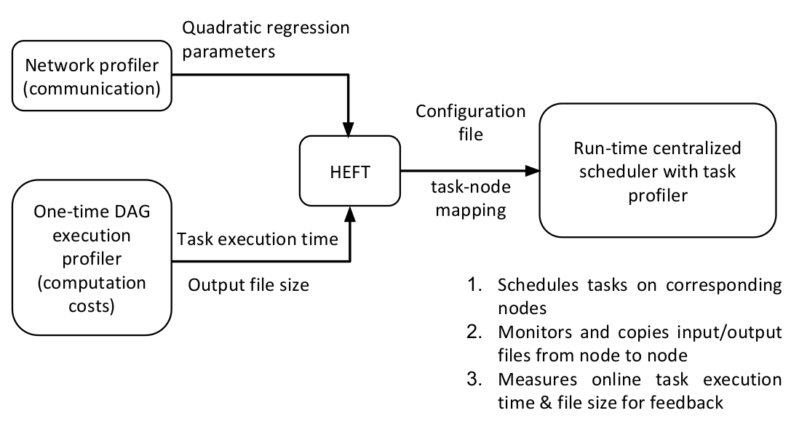

Overview
********

**CIRCE** is a runtime scheduling software tool for dispersed computing, which can deploy pipelined
computations described in the form of a directed acyclic graph (DAG) on multiple geographically
dispersed computers (compute nodes).

The tool run on a host node (also called scheduler node). It needs the information about 
compute nodes are available (such as IP address, username and password), the description of the 
DAG along with code for the corresponding tasks. Based on measurements of computation costs for each task on each node and the communication cost of transferring output data from one node to another, it first uses a
DAG-based static scheduling algorithm (at present, we include a modified version of an implementation [2]
of the well-known HEFT algorithm [1] with the tool) to determine at which node to place each task from the DAG. CIRCE then deploys the each tasks on the corresponding node, using input and output queues for pipelined execution and taking care of the data transfer between different nodes.

.. note:: We can use CIRCE as an independent tool.
 

The code is open source, and `available on GitHub`_.

.. _available on GitHub: https://github.com/ANRGUSC/CIRCE

We also use Distributed Network Anomaly Detection application (`DNAD`_) as an application example.

.. _DNAD: https://github.com/ANRGUSC/DNAD

Inputs
======

File nodes.txt
--------------

- List of nodes for the experiment, including the scheduler node. The user needs to fill the file with the appropriate IP addresses, usernames and passwords of their compute nodes:

+-----------+----+----------+----+
| scheduler | IP | username | pw |
+-----------+----+----------+----+
| node1     | IP | username | pw |
+-----------+----+----------+----+
| node2     | IP | username | pw |
+-----------+----+----------+----+
| node3     | IP | username | pw |
+-----------+----+----------+----+

File dag.txt and file configuration.txt
---------------------------------------

- DAG description of DAND (as adjacency list, where the first item is a parent task and subsequent items are child tasks) is kept in two files ``dag.txt`` (used by HEFT) and ``configuration.txt`` (``config_security.txt`` in this example):

	- Format of ``dag.txt``:

	.. code-block:: text
	    :linenos:

		local_pro aggregate0 aggregate1 aggregate2 
		aggregate0 simple_detector0 astute_detector0 
		aggregate1 simple_detector1 astute_detector1 
		aggregate2 1 true simple_detector2 astute_detector2  
		simple_detector0 fusion_center0 
		simple_detector1 fusion_center1 
		simple_detector2 fusion_center2 
		astute_detector0 fusion_center0 
		astute_detector1 fusion_center1 
		astute_detector2 fusion_center2 
		fusion_center0 global_fusion 
		fusion_center1 global_fusion 
		fusion_center2 global_fusion 
		global_fusion scheduler 

 	- Format of ``configuration.txt``:

 	.. code-block:: text
 	    :linenos:

 	    14
 	    local_pro 1 false aggregate0 aggregate1 aggregate2
 	    aggregate0 1 true simple_detector0 astute_detector0
 	    aggregate1 1 true simple_detector1 astute_detector1
 	    aggregate2 1 true simple_detector2 astute_detector2
 	    simple_detector0 1 true fusion_center0
 	    simple_detector1 1 true fusion_center1
 	    simple_detector2 1 true fusion_center2
 	    astute_detector0 1 true fusion_center0
 	    astute_detector1 1 true fusion_center1
 	    astute_detector2 1 true fusion_center2
 	    fusion_center0 2 true global_fusion
 	    fusion_center1 2 true global_fusion
 	    fusion_center2 2 true global_fusion
 	    global_fusion 3 true scheduler

- The first line is an integer, which gives the number of lines the DAG is taking in the file. DAG is represented in the form of adjacency list:

..  code-block:: text

    parent_task NUM_INPUTS FLAG child_task1 child_task2 child task3 ...

- ``parent_task`` is the name of the parent task

- ``NUM_INPUTS`` is an integer representing the number of input files the task needs in order to start processing (some tasks could require more than input).

- ``FLAG`` is ``true`` or ``false``. Based on its value, ``monitor.py`` will either send a single output of the task to all its children (when true), or it will wait the output files and start putting them into queue (when false). Once the queue size is equal to the number of children, it will send one output to one child (first output to first listed child, etc.).

- ``child_task1``, ``child_task2``, ``child_task3``... are the names of child tasks of the current parent task.
