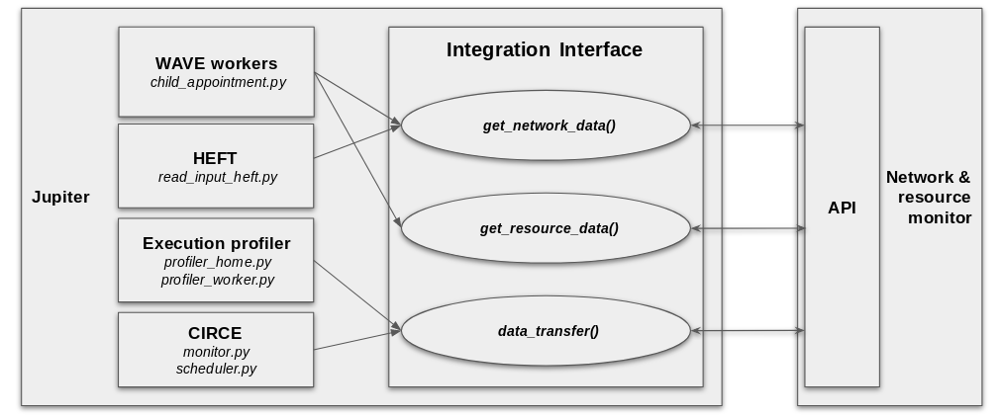
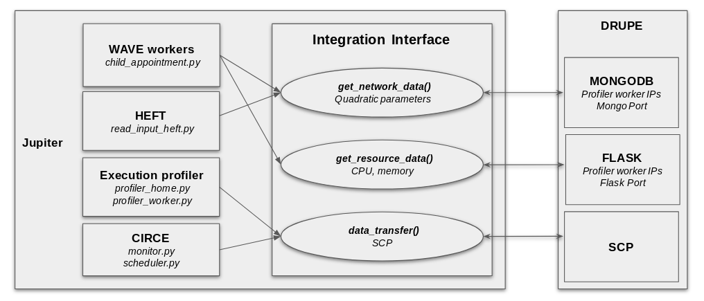
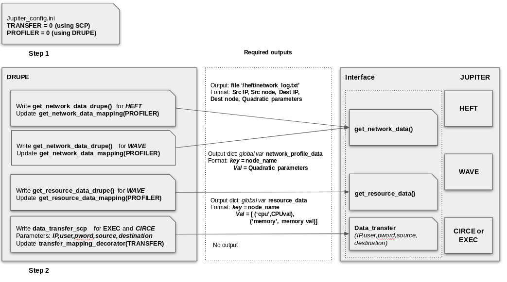

Integration Interface
=====================

Jupiter by default use ``SCP`` as the file transfer method and ``DRUPE`` as the network monitoring tool. We have decoupled these modules in Jupiter so that you can create and use your own modules if you want. 

   General Integration Interface between Jupiter and the Network & Resource Monitor Tool

   Example of SCP and DRUPE using the Integration Interface

The Jupiter integration interface use the following methods:

* ``get_network_data()`` : retrieve network data from the Network & Resource Monitor Tool.
* ``get_resource_data()`` : retrieve resource data from the Network & Resource Monitor Tool.
* ``data_transfer(IP,user,pword,resource,destination)``: transfer file to the destination node with provided information (IP,username,password) and file paths (source, destination).

.. warning:: The network data from the Network & Resource Monitor Tool working with Jupiter must be in the format of ``quadratic parameters`` which can specify the communication cost of the network links.

.. warning:: The resource data from the Network & Resource Monitor Tool working with Jupiter must be the combination of ``CPU and memory``.

Please follow the following guideline (with the examples from ``SCP`` and ``DRUPE``) to map your specific modules to the corresponding methods of the interface.

   The example with more detailed implementation.

File Transfer method 
--------------------

Write the data transfer function. In ``SCP`` example, the function is ``data_transfer_scp``. Add the corresponding mapping part for data transfer function:

.. code-block:: python
    :linenos:
    
    def transfer_mapping_decorator(TRANSFER):
	    def data_transfer_scp(IP,user,pword,source, destination):
	        retry = 0
	        while retry < num_retries:
	            try:
	                cmd = "sshpass -p %s scp -P %s -o StrictHostKeyChecking=no -r %s %s@%s:%s" % (pword, ssh_port, source, user, IP, destination)
	                os.system(cmd)
	                print('data transfer complete\n')
	                break
	            except:
	                print('profiler_worker.txt: SSH Connection refused or File transfer failed, will retry in 2 seconds')
	                time.sleep(2)
	                retry += 1

	    if TRANSFER==0:
	        return data_transfer_scp
	    return data_transfer_scp

Network & Resource Monitor Tool
-------------------------------

Get resource data
^^^^^^^^^^^^^^^^^

Write the resource data crawling function. In ``DRUPE`` example, the function is ``get_resource_data_drupe``. Add the corresponding mapping part for resource data crawling function:

.. code-block:: python
    :linenos:

    def get_resource_data_mapping(PROFILER=0):
	    if PROFILER==0: 
	        return profilers_mapping_decorator(get_resource_data_drupe)
	    return profilers_mapping_decorator(get_resource_data_drupe)

Get network data
^^^^^^^^^^^^^^^^

Write the network data crawling function. In ``DRUPE`` example, the function is ``get_network_data_drupe``. Add the corresponding mapping part for network data crawling function:

.. code-block:: python
    :linenos:

    def get_network_data_mapping(PROFILER=0):
	    if PROFILER==0: 
	        return profilers_mapping_decorator(get_network_data_drupe)
	    return profilers_mapping_decorator(get_network_data_drupe)
	   