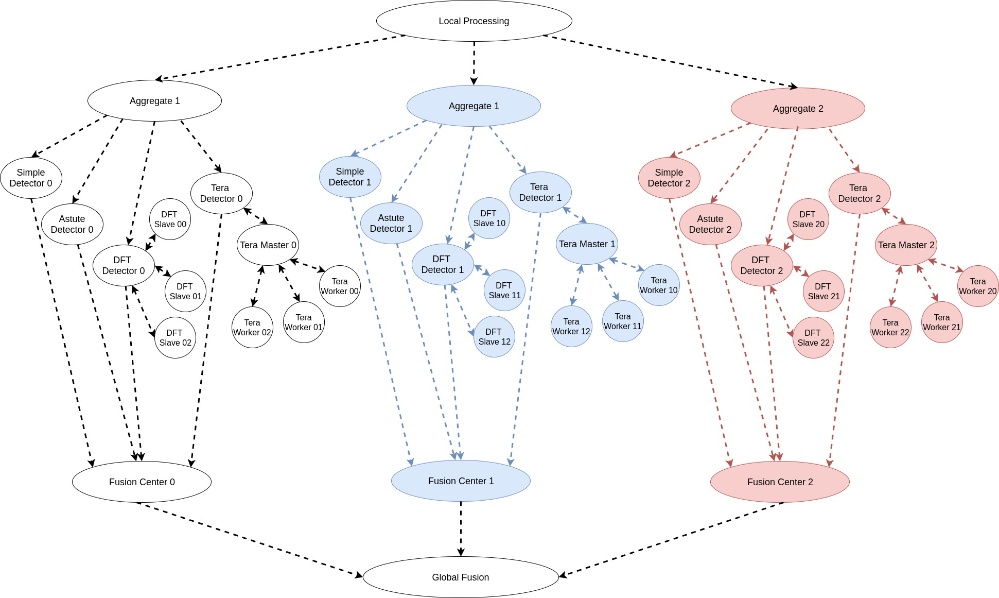

Applications 
************

Network Anomaly Detection
=========================

The `Coded DNAD`_ (Coded Network Anomaly Detection) is an application customized for Jupiter Orchestrator. Jupiter accepts pipelined computations described in a form of a Graph where the main task flow is represented as a Directed Acyclic Graph(DAG). Thus, one should be able separate the graph into two pieces, the DAG part and non-DAG part. Jupiter requires that each task in the DAG part of the graph to be written as a Python function in a separate file under the scripts folder. On the other hand the non-DAG tasks can be either Python function or a shell script with any number of arguments, located under the scripts folder.

.. _Coded DNAD: https://github.com/ANRGUSC/Coded-DNAD

Overview
--------
The application task graph, shown below, is intended for dispersed computing. It is inspired from Hashdoop [1, 2], where a MapReduce framework is used for anomaly detection. We have modified the codes from [2] to suit our purpose.

Input
-----
Convert the pcap file to a text file using `Ipsumdump`_ as follows:

.. _Ipsumdump: http://www.read.seas.harvard.edu/%7Ekohler/ipsumdump/

.. code-block:: bash
	:linenos:

	ipsumdump -tsSdDlpF -r botnet-capture-20110810-neris.pcap > botnet_summary.ipsum

References
----------

[1] Romain Fontugne, Johan Mazel, and Kensuke Fukuda. "Hashdoop: A mapreduce framework for network anomaly detection." Computer Communications Workshops (INFOCOM WORKSHOPS), IEEE Conference on. IEEE, 2014.

[2] `Hashdoop`_ GitHub Repository

[3] Fernando Silveira, Christophe Diot, Nina Taft, and Ramesh Govindan. "ASTUTE: Detecting a different class of traffic anomalies." ACM SIGCOMM Computer Communication Review 40.4 (2010): 267-278.

.. _Hashdoop: https://github.com/necoma/hashdoop

For more information, please refer to README file of the `Coded DNAD`_ repo. 
