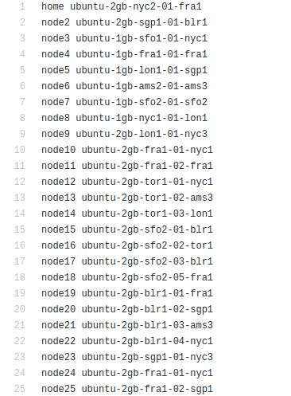
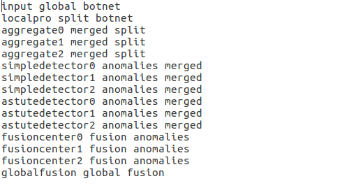

Applications 
************

Quick Integration
=================

In order to integrate your applications with Jupiter, there are some requirements in format and syntax for the inputs, outputs and task scripts.

Files ``nodes.txt``, ``jupiter_config.py`` and ``config.ini`` are found in the main folder of Jupiter and should be updated based on the requirements of users. Files  ``app_config.ini``, ``configurations.txt`` and ``name_convert.txt`` should be present in the application folder to support different Jupiter modules to work properly.

Input - File nodes.txt
----------------------

This file lists all the nodes, line by line, in the following format:

+-------+----------+
| home  | nodename | 
+=======+==========+
| node2 | nodename | 
+-------+----------+
| node3 | nodename | 
+-------+----------+
| node4 | nodename | 
+-------+----------+

A given sample of node file:

.. warning:: There are 2 kind of nodes: ``home node`` and ``compute node``. Home nodes start with ``home``, which allow stream of incoming data for the given DAG tasks as well as store all statistical performance information. Compute nodes start with ``node``, which will perform scheduling tasks and compute tasks. In the case of nonpricing CIRCE dispatcher, only 1 home node is supported. In the case of pricing CIRCE dispatcher (Event driven or Pushing scheme), multiple home nodes are supported. The home node list should be as followed: ``home``, ``home2``, ``home3``.

Input - File jupiter_config.py
------------------------------

This file includes all paths configuration for Jupiter system to start. The latest version of jupiter configuration file:

.. code-block:: text
    :linenos:

    global STATIC_MAPPING, SCHEDULER, TRANSFER, PROFILER, RUNTIME, PRICING, PRICE_OPTION

    STATIC_MAPPING          = int(config['CONFIG']['STATIC_MAPPING'])
    # scheduler option chosen from SCHEDULER_LIST
    SCHEDULER               = int(config['CONFIG']['SCHEDULER'])
    # transfer option chosen from TRANSFER_LIST
    TRANSFER                = int(config['CONFIG']['TRANSFER'])
    # Network and Resource profiler (TA2) option chosen from TA2_LIST
    PROFILER                = int(config['CONFIG']['PROFILER'])
    # Runtime profiling for data transfer methods: 0 for only senders, 1 for both senders and receivers
    RUNTIME                 = int(config['CONFIG']['RUNTIME'])
    # Using pricing or original scheme
    PRICING                 = int(config['CONFIG']['PRICING'])
    # Pricing option from pricing option list
    PRICE_OPTION          = int(config['CONFIG']['PRICE_OPTION'])

    """Authorization information in the containers"""
    global USERNAME, PASSWORD

    USERNAME                = config['AUTH']['USERNAME']
    PASSWORD                = config['AUTH']['PASSWORD']

    """Port and target port in containers for services to be used: Mongo, SSH and Flask"""
    global MONGO_SVC, MONGO_DOCKER, SSH_SVC, SSH_DOCKER, FLASK_SVC, FLASK_DOCKER
    
    MONGO_SVC               = config['PORT']['MONGO_SVC']
    MONGO_DOCKER            = config['PORT']['MONGO_DOCKER']
    SSH_SVC                 = config['PORT']['SSH_SVC']
    SSH_DOCKER              = config['PORT']['SSH_DOCKER']
    FLASK_SVC               = config['PORT']['FLASK_SVC']
    FLASK_DOCKER            = config['PORT']['FLASK_DOCKER']

    """Modules path of Jupiter"""
    global NETR_PROFILER_PATH, EXEC_PROFILER_PATH, CIRCE_PATH, HEFT_PATH, WAVE_PATH, SCRIPT_PATH, CIRCE_ORIGINAL_PATH

    # default network and resource profiler: DRUPE
    # default wave mapper: random wave
    NETR_PROFILER_PATH      = HERE + 'profilers/network_resource_profiler/'
    EXEC_PROFILER_PATH      = HERE + 'profilers/execution_profiler/'
    CIRCE_PATH              = HERE + 'circe/pricing/'
    HEFT_PATH               = HERE + 'task_mapper/heft/original/'
    WAVE_PATH               = HERE + 'task_mapper/wave/random_wave/'
    SCRIPT_PATH             = HERE + 'scripts/'

    global mapper_option
    mapper_option           = 'heft'    

    if SCHEDULER == int(config['SCHEDULER_LIST']['WAVE_RANDOM']):
        print('Task mapper: Wave random selected')
        WAVE_PATH           = HERE + 'task_mapper/wave/random_wave/'
        mapper_option       = 'random'
    elif SCHEDULER == int(config['SCHEDULER_LIST']['WAVE_GREEDY']):
        print('Task mapper: Wave greedy selected')
        WAVE_PATH           = HERE + 'task_mapper/wave/greedy_wave/'
        mapper_option       = 'greedy'
    elif SCHEDULER == int(config['SCHEDULER_LIST']['HEFT_MODIFIED']):
        print('Task mapper: Heft modified selected')
        HEFT_PATH           = HERE + 'task_mapper/heft/modified/'   
        mapper_option       = 'modified'
    else: 
        print('Task mapper: Heft original selected')

    global pricing_option, profiler_option

    pricing_option          = 'pricing' #original pricing
    profiler_option         = 'onehome'

    if PRICING == 1:#multiple home (push circe)
        pricing_option      = 'pricing_push'
        profiler_option     = 'multiple_home'
        NETR_PROFILER_PATH  = HERE + 'profilers/network_resource_profiler_mulhome/'
        EXEC_PROFILER_PATH  = HERE + 'profilers/execution_profiler_mulhome/'
        HEFT_PATH           = HERE + 'task_mapper/heft_mulhome/original/'
        WAVE_PATH           = HERE + 'task_mapper/wave_mulhome/greedy_wave/'
        print('Pricing pushing scheme selected')
    if PRICING == 2:#multiple home, pricing (event-driven circe)
        pricing_option      = 'pricing_event'
        profiler_option     = 'multiple_home'
        NETR_PROFILER_PATH  = HERE + 'profilers/network_resource_profiler_mulhome/'
        EXEC_PROFILER_PATH  = HERE + 'profilers/execution_profiler_mulhome/'
        HEFT_PATH           = HERE + 'task_mapper/heft_mulhome/original/'
        WAVE_PATH           = HERE + 'task_mapper/wave_mulhome/greedy_wave/'
        print('Pricing event driven scheme selected')

    CIRCE_PATH              = HERE + 'circe/%s/'%(pricing_option)
    if PRICING == 0: #non-pricing
        CIRCE_PATH          = HERE + 'circe/original/'  
        NETR_PROFILER_PATH  = HERE + 'profilers/network_resource_profiler_mulhome/'
        EXEC_PROFILER_PATH  = HERE + 'profilers/execution_profiler_mulhome/'
        HEFT_PATH           = HERE + 'task_mapper/heft_mulhome/original/'
        WAVE_PATH           = HERE + 'task_mapper/wave_mulhome/greedy_wave/'
        print('Non pricing scheme selected')
    """Kubernetes required information"""
    global KUBECONFIG_PATH, DEPLOYMENT_NAMESPACE, PROFILER_NAMESPACE, MAPPER_NAMESPACE, EXEC_NAMESPACE

    KUBECONFIG_PATH         = os.environ['KUBECONFIG']

    # Namespaces
    DEPLOYMENT_NAMESPACE    = 'johndoe-circe'
    PROFILER_NAMESPACE      = 'johndoe-profiler'
    MAPPER_NAMESPACE        = 'johndoe-mapper'
    EXEC_NAMESPACE          = 'johndoe-exec'

    """ Node file path and first task information """
    global HOME_NODE, HOME_CHILD

    HOME_NODE               = get_home_node(HERE + 'nodes.txt')
    HOME_CHILD              = 'sample_ingress_task1'

    """pricing CIRCE home and worker images"""
    global PRICING_HOME_IMAGE, WORKER_CONTROLLER_IMAGE, WORKER_COMPUTING_IMAGE

    PRICING_HOME_IMAGE      = 'docker.io/johndoe/%s_circe_home:coded' %(pricing_option)
    WORKER_CONTROLLER_IMAGE = 'docker.io/johndoe/%s_circe_controller:coded' %(pricing_option)
    WORKER_COMPUTING_IMAGE  = 'docker.io/johndoe/%s_circe_computing:coded' %(pricing_option)
    
    """CIRCE home and worker images for execution profiler"""
    global HOME_IMAGE, WORKER_IMAGE

    HOME_IMAGE              = 'docker.io/johndoe/circe_home:coded'
    WORKER_IMAGE            = 'docker.io/johndoe/circe_worker:coded'

    """DRUPE home and worker images"""
    global PROFILER_HOME_IMAGE, PROFILER_WORKER_IMAGE
    
    PROFILER_HOME_IMAGE     = 'docker.io/johndoe/%s_profiler_home:coded'%(profiler_option)
    PROFILER_WORKER_IMAGE   = 'docker.io/johndoe/%s_profiler_worker:coded'%(profiler_option)

    """WAVE home and worker images"""
    global WAVE_HOME_IMAGE, WAVE_WORKER_IMAGE

    #coded: random, v1: greedy

    WAVE_HOME_IMAGE         = 'docker.io/johndoe/%s_%s_wave_home:coded' %(mapper_option,profiler_option)
    WAVE_WORKER_IMAGE       = 'docker.io/johndoe/%s_%s_wave_worker:coded' %(mapper_option,profiler_option)

    """Execution profiler home and worker images"""
    global EXEC_HOME_IMAGE, EXEC_WORKER_IMAGE

    EXEC_HOME_IMAGE         = 'docker.io/johndoe/%s_exec_home:coded'%(profiler_option)
    EXEC_WORKER_IMAGE       = 'docker.io/johndoe/%s_exec_worker:coded'%(profiler_option)

    """HEFT docker image"""
    global HEFT_IMAGE

    HEFT_IMAGE              = 'docker.io/johndoe/%s_heft:coded'%(profiler_option)

    """Application Information"""
    global APP_PATH, APP_NAME

    APP_PATH                = HERE  + 'app_specific_files/network_monitoring_app/'
    APP_NAME                = 'app_specific_files/network_monitoring_app'

.. warning:: You need to create required namespaces in your Kubernetes cluster that will be dedicated to the profiler, scheduling mapper (to choose specific scheduling algorithms from HEFT, Random WAVE, greedy WAVE), and CIRCE deployments (non-pricing, pricing event driven or pricing push), respectively. You also need to update your namespace information correspondingly.

.. code-block:: python
    :linenos:
	
	DEPLOYMENT_NAMESPACE    = 'johndoe-circe'
	PROFILER_NAMESPACE      = 'johndoe-profiler'
	MAPPER_NAMESPACE        = 'johndoe-mapper'
	EXEC_NAMESPACE          = 'johndoe-exec'

You also need to specify the corresponding information:

- CIRCE images : ``HOME_IMAGE`` and ``WORKER_IMAGE``
- Pricing CIRCE images : ``PRICING_HOME_IMAGE``, ``WORKER_CONTROLLER_IMAGE`` and ``WORKER_COMPUTING_IMAGE``
- DRUPE images : ``PROFILER_HOME_IMAGE`` and ``PROFILER_WORKER_IMAGE``
- Execution profiler images: ``EXEC_HOME_IMAGE`` and ``EXEC_WORKER_IMAGE``
- HEFT images: ``HEFT_IMAGE``
- WAVE images : ``WAVE_HOME_IMAGE`` and ``WAVE_WORKER_IMAGE``
- Initial task : ``HOME_CHILD``
- The application folder : ``APP_PATH``. The tasks specific files is recommended to be put in the folder ``task_specific_files``.

Input - File config.ini
-----------------------

This file includes all configuration options for Jupiter system to start. The latest version of ``config.ini`` file includes types of mapping (static or dynamic), port information (SSH, Flask, Mongo), authorization (username and password), scheduling algorithm (HEFT original, random WAVE, greedy WAVE, HEFT modified):

.. code-block:: text
    :linenos:

    [CONFIG]
        STATIC_MAPPING = 0
        SCHEDULER = 1
        TRANSFER = 0
        PROFILER = 0
        RUNTIME = 1
        PRICING = 1
        PRICE_OPTION = 0
    [PORT]
        MONGO_SVC = 6200
        MONGO_DOCKER = 27017
        SSH_SVC = 5000
        SSH_DOCKER = 22
        FLASK_SVC = 6100
        FLASK_DOCKER = 8888
    [AUTH]
        USERNAME = root
        PASSWORD = PASSWORD
    [OTHER]
        MAX_LOG = 10
        SSH_RETRY_NUM = 20
        TASK_QUEUE_SIZE = -1
    [SCHEDULER_LIST]
        HEFT = 0
        WAVE_RANDOM = 1
        WAVE_GREEDY = 2
        HEFT_MODIFIED = 3
    [PROFILERS_LIST]
        DRUPE = 0
    [TRANSFER_LIST]
        SCP = 0
    [PRICING_LIST]
        NONPRICING = 0
        PUSH_MULTIPLEHOME = 1
        DRIVEN_MULTIPLEHOME = 2
    [PRICING_FUNCTION_LIST]
        SUM = 1
        MAX = 2

.. warning:: You can specify the following values:

    - ``PRICING`` in ``CONFIG`` section to choose the specific CIRCE dispatcher from the ``PRICING_LIST``. There are three kinds of CIRCE dispatcher: ``NONPRICING``, ``PUSH_MULTIPLEHOME`` and ``DRIVEN_MULTIPLEHOME``.

    - ``SCHEDULER`` in ``CONFIG`` section to choose the specific scheduling algorithm from the ``SCHEDULER_LIST``. ``STATIC_MAPPING`` is only chosen on testing purpose.

    - ``PROFILER`` in ``CONFIG`` section to choose the specific network monitoring from the ``PROFILERS_LIST``. The default network monitoring tool that we used is ``DRUPE``. If you want to use another network monitoring tool, please refer to the guideline how to use the interface.

    - ``TRANSFER`` in ``CONFIG`` section to choose the specific file transfer method for Jupiter from the ``TRANSFER_LIST``. The default file transfer method that we used is ``SCP``. If you want to use another file transfer method, please refer to the guideline how to use the interface. 

Input - File configuration.txt
------------------------------

The tasks specific files is recommended to be put in the folder ``task_specific_files``. Inside the application folder, there should be a ``configuration.txt`` file having the DAG description. First line is an integer which gives the number of lines the DAG is taking. DAG is represented in the form of adjacency list:

.. code-block:: text
    :linenos:

    parent_task NUM_INPUTS FLAG child_task1 child_task2 child task3 ...

- ``parent_task`` is the name of the parent task

- ``NUM_INPUTS`` is an integer representing the number of input files the task needs in order to start processing (some tasks could require more than input).

- ``FLAG`` is ``true`` or ``false``. Based on its value, ``monitor.py`` will either send a single output of the task to all its children (when true), or it will wait the output files and start putting them into queue (when false). Once the queue size is equal to the number of children, it will send one output to one child (first output to first listed child, etc.).

- ``child_task1``, ``child_task2``, ``child_task3``... are the names of child tasks of the current parent task.

A given sample of application configuration file:

.. figure::  images/app_config.png
   :align:   center

Input - File app_config.ini
---------------------------
Inside the application folder, there should be a ``app_config.ini`` file having the required specific ports for the application. If the application does not need any specific ports, then the ``app_config.ini`` with the two sections ``[DOCKER_PORT]`` and ``[SVC_PORT]`` should be left empty. The section ``[SVC_PORT]`` should specify the required ports needed for the application, and the section ``[DOCKER_PORT]`` should specify the corresponding target ports for the docker. 

.. code-block:: text
    :linenos:

    [DOCKER_PORT]
        PYTHON-PORT = 57021
    [SVC_PORT]
        PYTHON-PORT = 57021

Input - File input_node.txt
-----------------------------
This file is used by WAVE algorithm and provides the information of the compute node for the first task. Format of this file is given (in this case, node2 will perform the first task):

 +--------+----------+
 | task   | node     |
 +--------+----------+
 | task0  | node2    |
 +--------+----------+

Input - File name_convert.txt
-----------------------------

This file helps to output the correct performance statistics of Jupiter's runtime profiler, which lists all the task name, its corresponding input and output file name, line by line, in the following format:

+--------+-------------------+----------------------+
| input  | output_app_name   |   input_app_name     |
+========+===================+======================+
| task1  | output_task1_name |   input_task1_name   |
+--------+-------------------+----------------------+
| task2  | output_task2_name |   input_task2_name   | 
+--------+-------------------+----------------------+
| task3  | output_task3_name |   input_task3_name   | 
+--------+-------------------+----------------------+

A given sample of ``name_convert.txt`` file:

Output
------

.. note:: Taking the node list from ``nodes.txt`` and DAG information from ``configuration.txt``, Jupiter will consider both updated network connectivity (from ``DRUPE-network profiler`` or your chosen tool) and computational capabilities (from ``DRUPE - resource profiler`` or your chosen tool) of all the nodes in the system, Jupiter use the chosen scheduling algorithm (``HEFT original``, ``random WAVE``,``greedy WAVE`` or ``HEFT modified``) to give the optimized mapping of tasks and nodes in the system. Next, ``CIRCE`` will handle deploying the optimized mapping in the **Kubernetes** system.

Scripts format
--------------

Each task should be coded as a python script inside the ``scripts`` folder. Each code for a task must be placed inside a function called ``task`` that takes as arguments ``(inputfiles, inputpath, outputpath)`` and returns ``a list of output files``.

A given example of a task:

In the above example, ``onefile`` parameter requires the list of input filenames to the tasks, ``pathin`` parameter requires the absolute path of the input folder, ``pathout`` parameter requires the absolute path of the output folder, and the ``task`` function returns the absolute path of the out files generated by the task itself.  

Network Anomaly Detection
=========================

The `Coded DNAD`_ (Coded Network Anomaly Detection) is an application customized for Jupiter Orchestrator. Jupiter accepts pipelined computations described in a form of a Graph where the main task flow is represented as a Directed Acyclic Graph(DAG). Thus, one should be able separate the graph into two pieces, the DAG part and non-DAG part. Jupiter requires that each task in the DAG part of the graph to be written as a Python function in a separate file under the scripts folder. On the other hand the non-DAG tasks can be either Python function or a shell script with any number of arguments, located under the scripts folder.

.. _Coded DNAD: https://github.com/ANRGUSC/Coded-DNAD

Overview
--------
The application task graph, shown below, is intended for dispersed computing. It is inspired from Hashdoop [1, 2], where a MapReduce framework is used for anomaly detection. We have modified the codes from [2] to suit our purpose.

Input
-----
Convert the pcap file to a text file using `Ipsumdump`_ as follows:

.. _Ipsumdump: http://www.read.seas.harvard.edu/%7Ekohler/ipsumdump/

.. code-block:: bash
	:linenos:

	ipsumdump -tsSdDlpF -r botnet-capture-20110810-neris.pcap > botnet_summary.ipsum

References
----------

[1] Romain Fontugne, Johan Mazel, and Kensuke Fukuda. "Hashdoop: A mapreduce framework for network anomaly detection." Computer Communications Workshops (INFOCOM WORKSHOPS), IEEE Conference on. IEEE, 2014.

[2] `Hashdoop`_ GitHub Repository

[3] Fernando Silveira, Christophe Diot, Nina Taft, and Ramesh Govindan. "ASTUTE: Detecting a different class of traffic anomalies." ACM SIGCOMM Computer Communication Review 40.4 (2010): 267-278.

.. _Hashdoop: https://github.com/necoma/hashdoop

For more information, please refer to README file of the `Coded DNAD`_ repo. 
