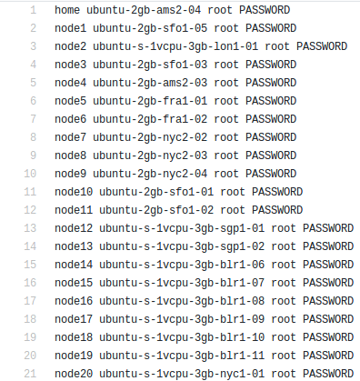
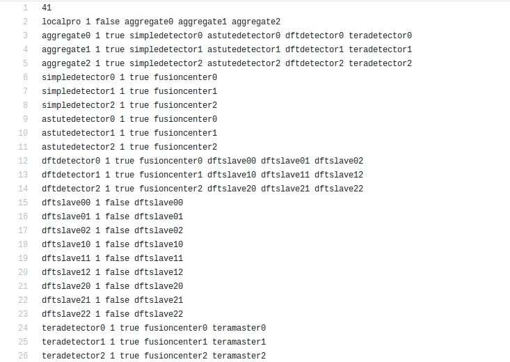
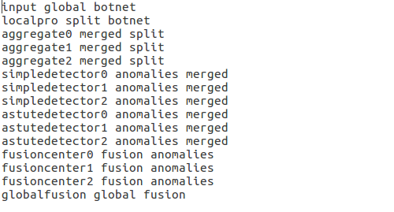

Overview
********

Components
==========

`Jupiter`_ is an Orchestrator for Dispersed Computing that uses `Docker`_ containers and `Kubernetes`_ (K8s). 

Jupiter enables complex computing applications that are specified as directed acyclic graph (DAG)-based task graphs to be distributed across an arbitrary network of computers in such a way as to optimize the execution of the distributed computations. Depending on the scheduling algorithm/task mapper used with the Jupiter framework, the optimizations may be for different objectives, for example, the goal may be to try and minimize the total end to end delay (makespan) of the computation for a single set of data inputs. Jupiter includes both centralized task mappers such as one that performs the classical HEFT (heterogeneous earliest finish time) scheduling algorithm, as well as an innovative new distributed task mapping framework called WAVE. In order to do enable optimization-oriented task mapping, Jupiter also provides tools for profiling the application run time on the computers as well as profiling and monitoring the performance of the network. Jupiter also provides for container-based code dispatch and execution of the distributed application at run-time for both single-shot and pipelined (streaming) computations.

The Jupiter system has three main components: Profilers, Task Mapper and `CIRCE`_ Dispatcher.

- Profilers are tools used to collect information about the system.

	- `DRUPE`_ (Network and Resource Profiler) is a tool to collect information about computational resources as well as network links between compute nodes in a dispersed computing system to a central node. DRUPE consists of a network profiler and a resource profiler.

	- The onetime Execution Profiler is a tool to collect information about the computation time of the pipelined computations described in the form of a directed acyclic graph (DAG) on each of the networked computation resources. This tool runs a sample execution of the entire DAG on every node to collect the statistics for each of the task in the DAG as well as the makespan of the entire DAG.

-  Task Mapper comes with three different versions: HEFT, WAVE Greedy, WAVE Random; to effciently map the task controllers of a DAG to the processors such that the makespan of the pipelines processing is optimized.
	
	- `HEFT`_ Heterogeneous Earliest Finish Time is a static centralized algorithm for a DAG based task graph that efficiently maps the tasks of the DAG into the processors by taking into account global information about communication delays and execution times.
	- `WAVE`_ is a distributed scheduler for DAG type task graph that outputs a mapping of task controllers to real compute nodes by only taking into acount local profiler statistics. Currently we have two types of WAVE algorithms: WAVE Random and WAVE Greedy. WAVE Random is a very simple algorithm that maps the tasks to a random node without taking into acount the profiler data. WAVE Greedy is a Greedy algorithm that uses a weighted sum of different profiler data to map tasks to the most suitable nodes.

-  `CIRCE`_ is a dispatcher tool for dispersed computing, which can deploy pipelined computations described in the form of a directed acyclic graph (DAG) on multiple geographically dispersed computers (compute nodes). CIRCE uses input and output queues for pipelined execution, and takes care of the data transfer between different tasks. ``CIRCE`` comes with three different versions: nonpricing scheme, pricing event driven scheme and pricing push scheme.

    - ``Nonpricing CIRCE``: static version of dispatcher, which deploys each task controllers on the corresponding compute node given the output of the chosen Task mapper. The task controller is also responsible for the corresponding task itself. This is one-time scheduler. If the user wants to reschedule the compute nodes, he has to run the deploy script again (run corresponding Task mapper and CIRCE again).
    - ``Pricing Event driven CIRCE``: dynamic version of dispatcher, which deploys each task controllers on the corresponding compute node given the output of the chosen Task mapper. Moreover, the task controller will select the best current available compute node to perform the task it is responsible for based on the updated resource information (communication delays, execution times, compute resource availability, queue delays at each compute node). The update is performed at the time the task controllers receive the incoming streaming file, the task controllers request the update from the compute nodes. 
    - ``Pricing Pushing CIRCE``: similar to  `Pricing Event driven CIRCE``, but the update is performed in a different way, in which the compute nodes push the update to the task controllers every interval.

.. _Jupiter: https://github.com/ANRGUSC/Jupiter
.. _Docker: https://docs.docker.com/
.. _Kubernetes: https://kubernetes.io/docs/home/
.. _DRUPE: https://github.com/ANRGUSC/DRUPE
.. _WAVE: https://github.com/ANRGUSC/WAVE
.. _CIRCE: https://github.com/ANRGUSC/CIRCE
.. _HEFT: https://en.wikipedia.org/wiki/Heterogeneous_Earliest_Finish_Time

The code is open source, and `available on GitHub`_.

.. _available on GitHub: https://github.com/ANRGUSC/Jupiter

Input
=====

Files ``nodes.txt``, ``jupiter_config.py`` and ``config.ini`` are found in the main folder of Jupiter and should be updated based on the requirements of users. Files  ``app_config.ini``, ``configurations.txt`` and ``name_convert.txt`` should be present in the application folder to support different Jupiter modules to work properly.

File nodes.txt
--------------

This file lists all the nodes, line by line, in the following format:

+-------+----------+
| home  | nodename | 
+=======+==========+
| node2 | nodename | 
+-------+----------+
| node3 | nodename | 
+-------+----------+
| node4 | nodename | 
+-------+----------+

A given sample of node file:

.. warning:: There are 2 kind of nodes: ``home node`` and ``compute node``. Home nodes start with ``home``, which allow stream of incoming data for the given DAG tasks as well as store all statistical performance information. Compute nodes start with ``node``, which will perform scheduling tasks and compute tasks. In the case of nonpricing CIRCE dispatcher, only 1 home node is supported. In the case of pricing CIRCE dispatcher (Event driven or Pushing scheme), multiple home nodes are supported. The home node list should be as followed: ``home``, ``home2``, ``home3``.

File jupiter_config.py
----------------------

This file includes all paths configuration for Jupiter system to start. The latest version of jupiter configuration file:

.. code-block:: text
    :linenos:

    global STATIC_MAPPING, SCHEDULER, TRANSFER, PROFILER, RUNTIME, PRICING, PRICE_OPTION

    STATIC_MAPPING          = int(config['CONFIG']['STATIC_MAPPING'])
    # scheduler option chosen from SCHEDULER_LIST
    SCHEDULER               = int(config['CONFIG']['SCHEDULER'])
    # transfer option chosen from TRANSFER_LIST
    TRANSFER                = int(config['CONFIG']['TRANSFER'])
    # Network and Resource profiler (TA2) option chosen from TA2_LIST
    PROFILER                = int(config['CONFIG']['PROFILER'])
    # Runtime profiling for data transfer methods: 0 for only senders, 1 for both senders and receivers
    RUNTIME                 = int(config['CONFIG']['RUNTIME'])
    # Using pricing or original scheme
    PRICING                 = int(config['CONFIG']['PRICING'])
    # Pricing option from pricing option list
    PRICE_OPTION          = int(config['CONFIG']['PRICE_OPTION'])

    """Authorization information in the containers"""
    global USERNAME, PASSWORD

    USERNAME                = config['AUTH']['USERNAME']
    PASSWORD                = config['AUTH']['PASSWORD']

    """Port and target port in containers for services to be used: Mongo, SSH and Flask"""
    global MONGO_SVC, MONGO_DOCKER, SSH_SVC, SSH_DOCKER, FLASK_SVC, FLASK_DOCKER
    
    MONGO_SVC               = config['PORT']['MONGO_SVC']
    MONGO_DOCKER            = config['PORT']['MONGO_DOCKER']
    SSH_SVC                 = config['PORT']['SSH_SVC']
    SSH_DOCKER              = config['PORT']['SSH_DOCKER']
    FLASK_SVC               = config['PORT']['FLASK_SVC']
    FLASK_DOCKER            = config['PORT']['FLASK_DOCKER']

    """Modules path of Jupiter"""
    global NETR_PROFILER_PATH, EXEC_PROFILER_PATH, CIRCE_PATH, HEFT_PATH, WAVE_PATH, SCRIPT_PATH, CIRCE_ORIGINAL_PATH

    # default network and resource profiler: DRUPE
    # default wave mapper: random wave
    NETR_PROFILER_PATH      = HERE + 'profilers/network_resource_profiler/'
    EXEC_PROFILER_PATH      = HERE + 'profilers/execution_profiler/'
    CIRCE_PATH              = HERE + 'circe/pricing/'
    HEFT_PATH               = HERE + 'task_mapper/heft/original/'
    WAVE_PATH               = HERE + 'task_mapper/wave/random_wave/'
    SCRIPT_PATH             = HERE + 'scripts/'

    global mapper_option
    mapper_option           = 'heft'    

    if SCHEDULER == int(config['SCHEDULER_LIST']['WAVE_RANDOM']):
        print('Task mapper: Wave random selected')
        WAVE_PATH           = HERE + 'task_mapper/wave/random_wave/'
        mapper_option       = 'random'
    elif SCHEDULER == int(config['SCHEDULER_LIST']['WAVE_GREEDY']):
        print('Task mapper: Wave greedy selected')
        WAVE_PATH           = HERE + 'task_mapper/wave/greedy_wave/'
        mapper_option       = 'greedy'
    elif SCHEDULER == int(config['SCHEDULER_LIST']['HEFT_MODIFIED']):
        print('Task mapper: Heft modified selected')
        HEFT_PATH           = HERE + 'task_mapper/heft/modified/'   
        mapper_option       = 'modified'
    else: 
        print('Task mapper: Heft original selected')

    global pricing_option, profiler_option

    pricing_option          = 'pricing' #original pricing
    profiler_option         = 'onehome'

    if PRICING == 1:#multiple home (push circe)
        pricing_option      = 'pricing_push'
        profiler_option     = 'multiple_home'
        NETR_PROFILER_PATH  = HERE + 'profilers/network_resource_profiler_mulhome/'
        EXEC_PROFILER_PATH  = HERE + 'profilers/execution_profiler_mulhome/'
        HEFT_PATH           = HERE + 'task_mapper/heft_mulhome/original/'
        WAVE_PATH           = HERE + 'task_mapper/wave_mulhome/greedy_wave/'
        print('Pricing pushing scheme selected')
    if PRICING == 2:#multiple home, pricing (event-driven circe)
        pricing_option      = 'pricing_event'
        profiler_option     = 'multiple_home'
        NETR_PROFILER_PATH  = HERE + 'profilers/network_resource_profiler_mulhome/'
        EXEC_PROFILER_PATH  = HERE + 'profilers/execution_profiler_mulhome/'
        HEFT_PATH           = HERE + 'task_mapper/heft_mulhome/original/'
        WAVE_PATH           = HERE + 'task_mapper/wave_mulhome/greedy_wave/'
        print('Pricing event driven scheme selected')

    CIRCE_PATH              = HERE + 'circe/%s/'%(pricing_option)
    if PRICING == 0: #non-pricing
        CIRCE_PATH          = HERE + 'circe/original/'  
        NETR_PROFILER_PATH  = HERE + 'profilers/network_resource_profiler_mulhome/'
        EXEC_PROFILER_PATH  = HERE + 'profilers/execution_profiler_mulhome/'
        HEFT_PATH           = HERE + 'task_mapper/heft_mulhome/original/'
        WAVE_PATH           = HERE + 'task_mapper/wave_mulhome/greedy_wave/'
        print('Non pricing scheme selected')
    """Kubernetes required information"""
    global KUBECONFIG_PATH, DEPLOYMENT_NAMESPACE, PROFILER_NAMESPACE, MAPPER_NAMESPACE, EXEC_NAMESPACE

    KUBECONFIG_PATH         = os.environ['KUBECONFIG']

    # Namespaces
    DEPLOYMENT_NAMESPACE    = 'johndoe-circe'
    PROFILER_NAMESPACE      = 'johndoe-profiler'
    MAPPER_NAMESPACE        = 'johndoe-mapper'
    EXEC_NAMESPACE          = 'johndoe-exec'

    """ Node file path and first task information """
    global HOME_NODE, HOME_CHILD

    HOME_NODE               = get_home_node(HERE + 'nodes.txt')
    HOME_CHILD              = 'sample_ingress_task1'

    """pricing CIRCE home and worker images"""
    global PRICING_HOME_IMAGE, WORKER_CONTROLLER_IMAGE, WORKER_COMPUTING_IMAGE

    PRICING_HOME_IMAGE      = 'docker.io/johndoe/%s_circe_home:coded' %(pricing_option)
    WORKER_CONTROLLER_IMAGE = 'docker.io/johndoe/%s_circe_controller:coded' %(pricing_option)
    WORKER_COMPUTING_IMAGE  = 'docker.io/johndoe/%s_circe_computing:coded' %(pricing_option)
    
    """CIRCE home and worker images for execution profiler"""
    global HOME_IMAGE, WORKER_IMAGE

    HOME_IMAGE              = 'docker.io/johndoe/circe_home:coded'
    WORKER_IMAGE            = 'docker.io/johndoe/circe_worker:coded'

    """DRUPE home and worker images"""
    global PROFILER_HOME_IMAGE, PROFILER_WORKER_IMAGE
    
    PROFILER_HOME_IMAGE     = 'docker.io/johndoe/%s_profiler_home:coded'%(profiler_option)
    PROFILER_WORKER_IMAGE   = 'docker.io/johndoe/%s_profiler_worker:coded'%(profiler_option)

    """WAVE home and worker images"""
    global WAVE_HOME_IMAGE, WAVE_WORKER_IMAGE

    #coded: random, v1: greedy

    WAVE_HOME_IMAGE         = 'docker.io/johndoe/%s_%s_wave_home:coded' %(mapper_option,profiler_option)
    WAVE_WORKER_IMAGE       = 'docker.io/johndoe/%s_%s_wave_worker:coded' %(mapper_option,profiler_option)

    """Execution profiler home and worker images"""
    global EXEC_HOME_IMAGE, EXEC_WORKER_IMAGE

    EXEC_HOME_IMAGE         = 'docker.io/johndoe/%s_exec_home:coded'%(profiler_option)
    EXEC_WORKER_IMAGE       = 'docker.io/johndoe/%s_exec_worker:coded'%(profiler_option)

    """HEFT docker image"""
    global HEFT_IMAGE

    HEFT_IMAGE              = 'docker.io/johndoe/%s_heft:coded'%(profiler_option)

    """Application Information"""
    global APP_PATH, APP_NAME

    APP_PATH                = HERE  + 'app_specific_files/network_monitoring_app/'
    APP_NAME                = 'app_specific_files/network_monitoring_app'

.. warning:: You need to create required namespaces in your Kubernetes cluster that will be dedicated to the profiler, scheduling mapper (to choose specific scheduling algorithms from HEFT, Random WAVE, greedy WAVE), and CIRCE deployments (non-pricing, pricing event driven or pricing push), respectively. You also need to update your namespace information correspondingly.

.. code-block:: python
    :linenos:
	
	DEPLOYMENT_NAMESPACE    = 'johndoe-circe'
	PROFILER_NAMESPACE      = 'johndoe-profiler'
	MAPPER_NAMESPACE        = 'johndoe-mapper'
	EXEC_NAMESPACE          = 'johndoe-exec'

You also need to specify the corresponding information:

- CIRCE images : ``HOME_IMAGE`` and ``WORKER_IMAGE``
- Pricing CIRCE images : ``PRICING_HOME_IMAGE``, ``WORKER_CONTROLLER_IMAGE`` and ``WORKER_COMPUTING_IMAGE``
- DRUPE images : ``PROFILER_HOME_IMAGE`` and ``PROFILER_WORKER_IMAGE``
- Execution profiler images: ``EXEC_HOME_IMAGE`` and ``EXEC_WORKER_IMAGE``
- HEFT images: ``HEFT_IMAGE``
- WAVE images : ``WAVE_HOME_IMAGE`` and ``WAVE_WORKER_IMAGE``
- Initial task : ``HOME_CHILD``
- The application folder : ``APP_PATH``. The tasks specific files is recommended to be put in the folder ``task_specific_files``.

File config.ini
---------------

This file includes all configuration options for Jupiter system to start. The latest version of ``config.ini`` file includes types of mapping (static or dynamic), port information (SSH, Flask, Mongo), authorization (username and password), scheduling algorithm (HEFT original, random WAVE, greedy WAVE, HEFT modified):

.. code-block:: text
    :linenos:

    [CONFIG]
        STATIC_MAPPING = 0
        SCHEDULER = 1
        TRANSFER = 0
        PROFILER = 0
        RUNTIME = 1
        PRICING = 1
        PRICE_OPTION = 0
    [PORT]
        MONGO_SVC = 6200
        MONGO_DOCKER = 27017
        SSH_SVC = 5000
        SSH_DOCKER = 22
        FLASK_SVC = 6100
        FLASK_DOCKER = 8888
    [AUTH]
        USERNAME = root
        PASSWORD = PASSWORD
    [OTHER]
        MAX_LOG = 10
        SSH_RETRY_NUM = 20
        TASK_QUEUE_SIZE = -1
    [SCHEDULER_LIST]
        HEFT = 0
        WAVE_RANDOM = 1
        WAVE_GREEDY = 2
        HEFT_MODIFIED = 3
    [PROFILERS_LIST]
        DRUPE = 0
    [TRANSFER_LIST]
        SCP = 0
    [PRICING_LIST]
        NONPRICING = 0
        PUSH_MULTIPLEHOME = 1
        DRIVEN_MULTIPLEHOME = 2
    [PRICING_FUNCTION_LIST]
        SUM = 1
        MAX = 2

.. warning:: You can specify the following values:

    - ``PRICING`` in ``CONFIG`` section to choose the specific CIRCE dispatcher from the ``PRICING_LIST``. There are three kinds of CIRCE dispatcher: ``NONPRICING``, ``PUSH_MULTIPLEHOME`` and ``DRIVEN_MULTIPLEHOME``.

    - ``SCHEDULER`` in ``CONFIG`` section to choose the specific scheduling algorithm from the ``SCHEDULER_LIST``. ``STATIC_MAPPING`` is only chosen on testing purpose.

    - ``PROFILER`` in ``CONFIG`` section to choose the specific network monitoring from the ``PROFILERS_LIST``. The default network monitoring tool that we used is ``DRUPE``. If you want to use another network monitoring tool, please refer to the guideline how to use the interface.

    - ``TRANSFER`` in ``CONFIG`` section to choose the specific file transfer method for Jupiter from the ``TRANSFER_LIST``. The default file transfer method that we used is ``SCP``. If you want to use another file transfer method, please refer to the guideline how to use the interface. 

File configuration.txt
----------------------

The tasks specific files is recommended to be put in the folder ``task_specific_files``. Inside the application folder, there should be a ``configuration.txt`` file having the DAG description. First line is an integer which gives the number of lines the DAG is taking. DAG is represented in the form of adjacency list:

.. code-block:: text
    :linenos:

    parent_task NUM_INPUTS FLAG child_task1 child_task2 child task3 ...

- ``parent_task`` is the name of the parent task

- ``NUM_INPUTS`` is an integer representing the number of input files the task needs in order to start processing (some tasks could require more than input).

- ``FLAG`` is ``true`` or ``false``. Based on its value, ``monitor.py`` will either send a single output of the task to all its children (when true), or it will wait the output files and start putting them into queue (when false). Once the queue size is equal to the number of children, it will send one output to one child (first output to first listed child, etc.).

- ``child_task1``, ``child_task2``, ``child_task3``... are the names of child tasks of the current parent task.

A given sample of application configuration file:

File app_config.ini
-------------------
Inside the application folder, there should be a ``app_config.ini`` file having the required specific ports for the application. If the application does not need any specific ports, then the ``app_config.ini`` with the two sections ``[DOCKER_PORT]`` and ``[SVC_PORT]`` should be left empty. The section ``[SVC_PORT]`` should specify the required ports needed for the application, and the section ``[DOCKER_PORT]`` should specify the corresponding target ports for the docker. 

.. code-block:: text
    :linenos:

    [DOCKER_PORT]
        PYTHON-PORT = 57021
    [SVC_PORT]
        PYTHON-PORT = 57021

File name_convert.txt
---------------------

This file helps to output the correct performance statistics of Jupiter's runtime profiler, which lists all the task name, its corresponding input and output file name, line by line, in the following format:

+--------+-------------------+----------------------+
| input  | output_app_name   |   input_app_name     |
+========+===================+======================+
| task1  | output_task1_name |   input_task1_name   |
+--------+-------------------+----------------------+
| task2  | output_task2_name |   input_task2_name   | 
+--------+-------------------+----------------------+
| task3  | output_task3_name |   input_task3_name   | 
+--------+-------------------+----------------------+

A given sample of ``name_convert.txt`` file:

Output
======

.. note:: Taking the node list from ``nodes.txt`` and DAG information from ``configuration.txt``, Jupiter will consider both updated network connectivity (from ``DRUPE-network profiler`` or your chosen tool) and computational capabilities (from ``DRUPE - resource profiler`` or your chosen tool) of all the nodes in the system, Jupiter use the chosen scheduling algorithm (``HEFT original``, ``random WAVE``,``greedy WAVE`` or ``HEFT modified``) to give the optimized mapping of tasks and nodes in the system. Next, ``CIRCE`` will handle deploying the optimized mapping in the **Kubernetes** system.

