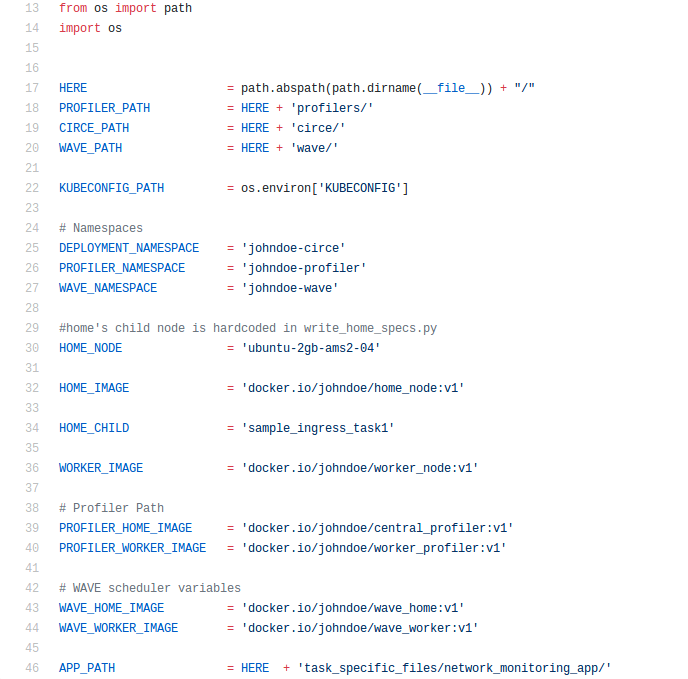

Overview
********

Components
==========

The Jupiter system has three main components: `DRUPE`_ (Network and Resource Profiler), `WAVE`_ Scheduler, and `CIRCE`_ Dispatcher.

.. _DRUPE: https://github.com/ANRGUSC/DRUPE
.. _WAVE: https://github.com/ANRGUSC/WAVE
.. _CIRCE: https://github.com/ANRGUSC/CIRCE

- `DRUPE`_ is a tool to collect information about computational resources as well as network links between compute nodes in a dispersed computing system to a central node. DRUPE consists of a network profiler and a resource profiler. 

- `WAVE`_ is a distributed scheduler for DAG type task graph that outputs a mapping of tasks to real compute nodes.

- `CIRCE`_ is a dispatcher tool for dispersed computing, which can deploy pipelined computations described in the form of a directed acyclic graph (DAG) on multiple geographically dispersed computers (compute nodes). CIRCE deploys each task on the corresponding compute node (from the output of WAVE), uses input and output queues for pipelined execution, and takes care of the data transfer between different tasks.

The code is open source, and `available on GitHub`_.

.. _available on GitHub: https://github.com/ANRGUSC/Jupiter

Input
=====

File nodes.txt
--------------

This file lists all the nodes, line by line, in the following format:

+-------+----------+----------+-----+
| home  | nodename | username | pw  |
+=======+==========+==========+=====+
| node1 | nodename | username | pw  |
+-------+----------+----------+-----+
| node2 | nodename | username | pw  |
+-------+----------+----------+-----+
| node3 | nodename | username | pw  |
+-------+----------+----------+-----+

A given sample of node file:

.. figure::  images/nodes.png
   :align:   center

File jupiter_config.py
----------------------

This file includes all configuration for Jupiter system to start. A given sample of jupiter configuration file:

.. warning:: You need to create three difference namespaces in your Kubernetes cluster that will be dedicated to the profiler, WAVE, and CIRCE deployments, respectively. You also need to update your namespace information correspondingly.

.. code-block:: python
    :linenos:

    DEPLOYMENT_NAMESPACE    = 'johndoe-circe'
    PROFILER_NAMESPACE      = 'johndoe-profiler'
    WAVE_NAMESPACE          = 'johndoe-wave'

You also need to specify the corresponding information:

- CIRCE images : ``HOME_IMAGE`` and ``WORKER_IMAGE``
- DRUPE images : ``PROFILER_HOME_IMAGE`` and ``PROFILER_WORKER_IMAGE``
- WAVE images : ``WAVE_HOME_IMAGE`` and ``WAVE_WORKER_IMAGE``
- Initial task : ``HOME_CHILD``
- The application folder : ``APP_PATH``. The tasks specific files is recommended to be put in the folder ``task_specific_files``.

File configuration.txt
----------------------

The tasks specific files is recommended to be put in the folder ``task_specific_files``. Inside the application folder, there should be a ``configuration.txt`` file having the DAG description. First line is an integer which gives the number of lines the DAG is taking. DAG is represented in the form of adjacency list:

.. code-block:: text
    :linenos:

    parent_task NUM_INPUTS FLAG child_task1 child_task2 child task3 ...

- ``parent_task`` is the name of the parent task

- ``NUM_INPUTS`` is an integer representing the number of input files the task needs in order to start processing (some tasks could require more than input).

- ``FLAG`` is ``true`` or ``false``. Based on its value, ``monitor.py`` will either send a single output of the task to all its children (when true), or it will wait the output files and start putting them into queue (when false). Once the queue size is equal to the number of children, it will send one output to one child (first output to first listed child, etc.).

- ``child_task1``, ``child_task2``, ``child_task3``... are the names of child tasks of the current parent task.

A given sample of application configuration file:

.. figure::  images/app_config.png
   :align:   center

Output
======

.. note:: Taking the node list from ``nodes.txt`` and DAG information from ``configuration.txt``, Jupiter will consider both updated network connectivity (from ``DRUPE-network profiler`` ) and computational capabilities (from ``DRUPE - resource profiler``) of all the nodes in the system, Jupiter use ``WAVE`` to give the optimized mapping of tasks and nodes in the system. Next, ``CIRCE`` will handle deploying the optimized mapping in the real system.

