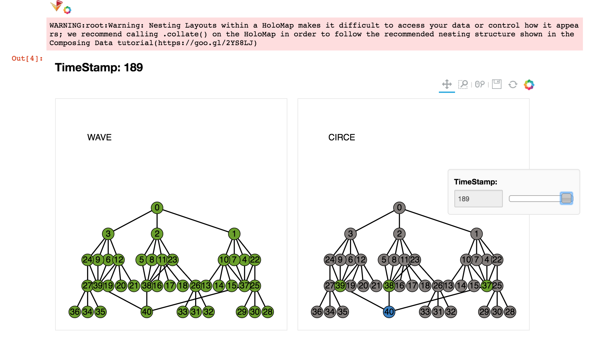

Jupiter Visualization
=====================

The visualization tool for **Jupiter** is given `here`_. This tool generates an interactive plot to show the scheduling result of WAVE and the dispatcher mapping of CIRCE.

.. _here : https://github.com/ANRGUSC/Jupiter_Visualization 

.. warning:: To visualize your own application, make sure the format of your logs are in line with the input files of the tools. We will integrate this as a real-time visualization tool for Jupiter in the next release.  

